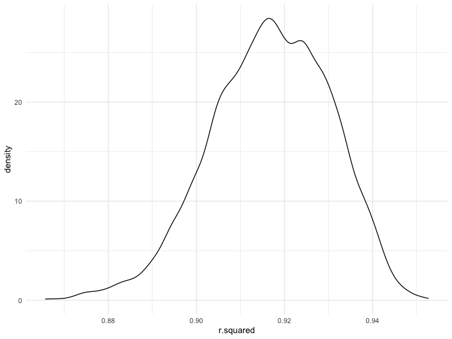
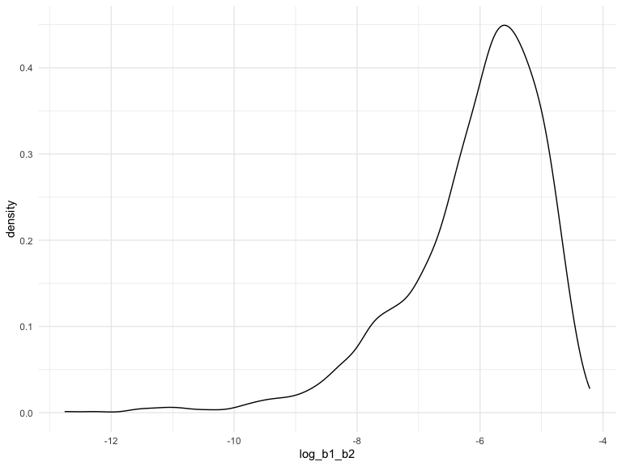

p8105_hw6_sc5351
================
Shaoyu Chen

``` r
library(tidyverse)
library(modelr)
```

### Problem 1

\#Create a city_state variable (e.g. “Baltimore, MD”), and a binary
variable indicating whether the homicide is solved. Omit cities Dallas,
TX; Phoenix, AZ; and Kansas City, MO – these don’t report victim race.
Also omit Tulsa, AL – this is a data entry mistake. For this problem,
limit your analysis those for whom victim_race is white or black. Be
sure that victim_age is numeric.

``` r
homicide_df = 
  read_csv("./data/homicide-data.csv", na = c("", "NA", "Unknown")) |> 
  mutate(
    city_state = str_c(city, state, sep = ", "),
    victim_age = as.numeric(victim_age),
    resolution = case_when(
      disposition == "Closed without arrest" ~ 0,
      disposition == "Open/No arrest"        ~ 0,
      disposition == "Closed by arrest"      ~ 1)
  ) |> 
  filter(victim_race %in% c("White", "Black")) |> 
  filter(!(city_state %in% c("Tulsa, AL", "Dallas, TX", "Phoenix, AZ", "Kansas City, MO"))) |> 
  select(city_state, resolution, victim_age, victim_sex, victim_race)
```

    ## Rows: 52179 Columns: 12
    ## ── Column specification ────────────────────────────────────────────────────────
    ## Delimiter: ","
    ## chr (8): uid, victim_last, victim_first, victim_race, victim_sex, city, stat...
    ## dbl (4): reported_date, victim_age, lat, lon
    ## 
    ## ℹ Use `spec()` to retrieve the full column specification for this data.
    ## ℹ Specify the column types or set `show_col_types = FALSE` to quiet this message.

\#For the city of Baltimore, MD, use the glm function to fit a logistic
regression with resolved vs unresolved as the outcome and victim age,
sex and race as predictors. Save the output of glm as an R object; apply
the broom::tidy to this object; and obtain the estimate and confidence
interval of the adjusted odds ratio for solving homicides comparing male
victims to female victims keeping all other variables fixed.

``` r
baltimore_glm = 
  filter(homicide_df, city_state == "Baltimore, MD") |> 
  glm(resolution ~ victim_age + victim_sex + victim_race, family = binomial(), data = _)

baltimore_glm |> 
  broom::tidy() |> 
  mutate(
    OR = exp(estimate), 
    OR_CI_upper = exp(estimate + 1.96 * std.error),
    OR_CI_lower = exp(estimate - 1.96 * std.error)) |> 
  filter(term == "victim_sexMale") |> 
  select(OR, OR_CI_lower, OR_CI_upper) |>
  knitr::kable(digits = 3)
```

|    OR | OR_CI_lower | OR_CI_upper |
|------:|------------:|------------:|
| 0.426 |       0.325 |       0.558 |

\#Now run glm for each of the cities in your dataset, and extract the
adjusted odds ratio (and CI) for solving homicides comparing male
victims to female victims. Do this within a “tidy” pipeline, making use
of purrr::map, list columns, and unnest as necessary to create a
dataframe with estimated ORs and CIs for each city.

``` r
model_results = 
  homicide_df |> 
  nest(data = -city_state) |> 
  mutate(
    models = map(data, \(df) glm(resolution ~ victim_age + victim_sex + victim_race, 
                             family = binomial(), data = df)),
    tidy_models = map(models, broom::tidy)) |> 
  select(-models, -data) |> 
  unnest(cols = tidy_models) |> 
  mutate(
    OR = exp(estimate), 
    OR_CI_upper = exp(estimate + 1.96 * std.error),
    OR_CI_lower = exp(estimate - 1.96 * std.error)) |> 
  filter(term == "victim_sexMale") |> 
  select(city_state, OR, OR_CI_lower, OR_CI_upper)

model_results |>
  slice(1:5) |> 
  knitr::kable(digits = 3)
```

| city_state      |    OR | OR_CI_lower | OR_CI_upper |
|:----------------|------:|------------:|------------:|
| Albuquerque, NM | 1.767 |       0.831 |       3.761 |
| Atlanta, GA     | 1.000 |       0.684 |       1.463 |
| Baltimore, MD   | 0.426 |       0.325 |       0.558 |
| Baton Rouge, LA | 0.381 |       0.209 |       0.695 |
| Birmingham, AL  | 0.870 |       0.574 |       1.318 |

\#Create a plot that shows the estimated ORs and CIs for each city.
Organize cities according to estimated OR, and comment on the plot.

``` r
model_results |> 
  mutate(city_state = fct_reorder(city_state, OR)) |> 
  ggplot(aes(x = city_state, y = OR)) + 
  geom_point() + 
  geom_errorbar(aes(ymin = OR_CI_lower, ymax = OR_CI_upper)) + 
  theme(axis.text.x = element_text(angle = 90, hjust = 1))
```


### Problem 2

\#First,download the weather data.

``` r
weather_df = 
  rnoaa::meteo_pull_monitors(
    c("USW00094728"),
    var = c("PRCP", "TMIN", "TMAX"), 
    date_min = "2022-01-01",
    date_max = "2022-12-31") |>
  mutate(
    name = recode(id, USW00094728 = "CentralPark_NY"),
    tmin = tmin / 10,
    tmax = tmax / 10) |>
  select(name, id, everything())
```

    ## using cached file: /Users/chenshaoyu/Library/Caches/org.R-project.R/R/rnoaa/noaa_ghcnd/USW00094728.dly

    ## date created (size, mb): 2023-12-02 18:06:24.70211 (8.544)

    ## file min/max dates: 1869-01-01 / 2023-11-30

\#Create bootstrap function

``` r
boot_sample = function(df) {
  
  sample_frac(df, replace = TRUE)
  
}
```

\#Use 5000 bootstrap samples and, for each bootstrap sample, produce
estimates of rsquare

``` r
boot_r_data = 
  weather_df |> 
  modelr::bootstrap(n = 5000) |>
  mutate(
    models = map(strap,  ~lm(tmax ~ tmin + prcp, data = .)),
    glance = map(models, broom::glance))|>
  select(-strap,-models)|>
  unnest(glance)
boot_r_data
```

    ## # A tibble: 5,000 × 13
    ##    .id   r.squared adj.r.squared sigma statistic   p.value    df logLik   AIC
    ##    <chr>     <dbl>         <dbl> <dbl>     <dbl>     <dbl> <dbl>  <dbl> <dbl>
    ##  1 0001      0.898         0.898  3.15     1601. 1.73e-180     2  -936. 1879.
    ##  2 0002      0.928         0.928  2.65     2338. 1.05e-207     2  -873. 1753.
    ##  3 0003      0.925         0.925  2.66     2236. 1.78e-204     2  -873. 1755.
    ##  4 0004      0.931         0.931  2.61     2448. 4.47e-211     2  -867. 1743.
    ##  5 0005      0.915         0.914  2.86     1937. 4.31e-194     2  -900. 1809.
    ##  6 0006      0.918         0.917  2.97     2023. 3.18e-197     2  -914. 1836.
    ##  7 0007      0.922         0.922  2.94     2139. 2.95e-201     2  -909. 1827.
    ##  8 0008      0.910         0.909  3.03     1827. 7.12e-190     2  -921. 1851.
    ##  9 0009      0.910         0.910  3.10     1834. 3.79e-190     2  -929. 1866.
    ## 10 0010      0.939         0.939  2.55     2788. 1.26e-220     2  -858. 1724.
    ## # ℹ 4,990 more rows
    ## # ℹ 4 more variables: BIC <dbl>, deviance <dbl>, df.residual <int>, nobs <int>

\#Plot the distribution of rsquare

``` r
r_plot =
  boot_r_data|>
  ggplot(aes(x = r.squared)) +
  geom_density()
r_plot
```


The plot is a left-skewed of R-squared, and the peak of the density is
around 0.92.

\#construct 95% confidence interval of rsquare.

``` r
r_squared_ci = 
  boot_r_data |>
  select(r.squared) |>
  summarize(
    ci_lower = quantile(r.squared, 0.025),
    ci_upper = quantile(r.squared, 0.975)
  )

r_squared_ci
```

    ## # A tibble: 1 × 2
    ##   ci_lower ci_upper
    ##      <dbl>    <dbl>
    ## 1    0.889    0.941

A 95% confidence interval for the rsquared is between 0.889 and 0.941.

\#Use 5000 bootstrap samples and, for each bootstrap sample, produce
estimates of log(beta1\*beta2).

``` r
boot_log_data = 
  weather_df |> 
  modelr::bootstrap(n = 5000) |>
  mutate(
    models = map(strap, ~lm(tmax ~ tmin + prcp, data = .)),
    results = map(models, broom::tidy))|>
  select(-strap,-models)|>
  unnest(results) |>
  select(.id, term, estimate) |> 
  pivot_wider(
    names_from = term, 
    values_from = estimate) |> 
  rename(beta1 = tmin, beta2 = prcp) |>
  mutate(log_b1_b2 = log(beta1 * beta2))
boot_log_data
```

    ## # A tibble: 5,000 × 5
    ##    .id   `(Intercept)` beta1     beta2 log_b1_b2
    ##    <chr>         <dbl> <dbl>     <dbl>     <dbl>
    ##  1 0001           8.16 0.998  0.00236      -6.05
    ##  2 0002           8.35 0.988  0.00103      -6.89
    ##  3 0003           7.81 1.02  -0.00200     NaN   
    ##  4 0004           7.93 1.02  -0.00681     NaN   
    ##  5 0005           8.06 1.02   0.000945     -6.95
    ##  6 0006           8.15 0.997  0.00776      -4.86
    ##  7 0007           7.90 1.01   0.000538     -7.52
    ##  8 0008           7.81 1.02  -0.00110     NaN   
    ##  9 0009           7.61 1.04  -0.00472     NaN   
    ## 10 0010           8.05 1.01   0.000396     -7.83
    ## # ℹ 4,990 more rows

``` r
log_beta_plot =
  boot_log_data|>
  filter(log_b1_b2 != "NaN") |>
  select(log_b1_b2)|>
  ggplot(aes(x = log_b1_b2)) +
  geom_density()
log_beta_plot
```


The plot is a left-skewed of R-squared, and the peak of the density is
around -5.5.

\#construct 95% confidence interval of log(beta1\*beta2).

``` r
log_beta_ci =
  boot_log_data|>
  select(log_b1_b2)|>
  summarize(
    ci_lower = quantile(log_b1_b2, 0.025,na.rm = TRUE),
    ci_upper = quantile(log_b1_b2, 0.975,na.rm = TRUE)
  )
log_beta_ci
```

    ## # A tibble: 1 × 2
    ##   ci_lower ci_upper
    ##      <dbl>    <dbl>
    ## 1    -8.88    -4.60

A 95% confidence interval for the log(beta1 \* beta2) is between -8.896
and -4.590.

### Problem 3

\#data clean

``` r
birthweight_data =
  read_csv("./data/birthweight.csv")|>
  janitor::clean_names()|>
  mutate(babysex = factor(case_when(
                           babysex == 1 ~ "male",
                           babysex == 2 ~ "female")),
         
         frace = factor(case_when(
                           frace == 1 ~ "White",
                           frace == 2 ~ "Black",
                           frace == 3 ~ "Asian",
                           frace == 4 ~ "Puerto Rican",
                           frace == 8 ~ "Other",
                           frace == 9 ~ "Unknown")),
         
         malform = factor(case_when(
                           malform == 0 ~ "absent",
                           malform == 1 ~ "present")),
         
         mrace = factor(case_when(mrace == 1 ~ "White",
                           mrace == 2 ~ "Black",
                           mrace == 3 ~ "Asian",
                           mrace == 4 ~ "Puerto Rican",
                           mrace == 8 ~ "Other")))
```

    ## Rows: 4342 Columns: 20
    ## ── Column specification ────────────────────────────────────────────────────────
    ## Delimiter: ","
    ## dbl (20): babysex, bhead, blength, bwt, delwt, fincome, frace, gaweeks, malf...
    ## 
    ## ℹ Use `spec()` to retrieve the full column specification for this data.
    ## ℹ Specify the column types or set `show_col_types = FALSE` to quiet this message.

\#then, check the missing data.

``` r
sum(is.na(birthweight_data))
```

    ## [1] 0

There is no missing data in birthweight_data.

\#Regression Models for birthweight_data.

``` r
bwt_model = lm(bwt ~ ., data = birthweight_data)
summary(bwt_model)
```

    ## 
    ## Call:
    ## lm(formula = bwt ~ ., data = birthweight_data)
    ## 
    ## Residuals:
    ##      Min       1Q   Median       3Q      Max 
    ## -1097.68  -184.86    -3.33   173.09  2344.15 
    ## 
    ## Coefficients: (3 not defined because of singularities)
    ##                     Estimate Std. Error t value Pr(>|t|)    
    ## (Intercept)       -6306.8346   659.2640  -9.566  < 2e-16 ***
    ## babysexmale         -28.7073     8.4652  -3.391 0.000702 ***
    ## bhead               130.7781     3.4523  37.881  < 2e-16 ***
    ## blength              74.9536     2.0217  37.075  < 2e-16 ***
    ## delwt                 4.1007     0.3948  10.386  < 2e-16 ***
    ## fincome               0.2898     0.1795   1.614 0.106551    
    ## fraceBlack           -6.9048    78.8349  -0.088 0.930210    
    ## fraceOther          -16.9392    97.5932  -0.174 0.862212    
    ## fracePuerto Rican   -68.2323    78.4692  -0.870 0.384599    
    ## fraceWhite          -21.2361    69.2960  -0.306 0.759273    
    ## gaweeks              11.5494     1.4654   7.882 4.06e-15 ***
    ## malformpresent        9.7650    70.6259   0.138 0.890039    
    ## menarche             -3.5508     2.8951  -1.226 0.220083    
    ## mheight               9.7874    10.3116   0.949 0.342588    
    ## momage                0.7593     1.2221   0.621 0.534418    
    ## mraceBlack          -60.0488    80.9532  -0.742 0.458266    
    ## mracePuerto Rican    34.9079    80.9481   0.431 0.666317    
    ## mraceWhite           91.3866    71.9190   1.271 0.203908    
    ## parity               95.5411    40.4793   2.360 0.018307 *  
    ## pnumlbw                   NA         NA      NA       NA    
    ## pnumsga                   NA         NA      NA       NA    
    ## ppbmi                 4.3538    14.8913   0.292 0.770017    
    ## ppwt                 -3.4716     2.6121  -1.329 0.183913    
    ## smoken               -4.8544     0.5871  -8.269  < 2e-16 ***
    ## wtgain                    NA         NA      NA       NA    
    ## ---
    ## Signif. codes:  0 '***' 0.001 '**' 0.01 '*' 0.05 '.' 0.1 ' ' 1
    ## 
    ## Residual standard error: 272.5 on 4320 degrees of freedom
    ## Multiple R-squared:  0.7183, Adjusted R-squared:  0.717 
    ## F-statistic: 524.6 on 21 and 4320 DF,  p-value: < 2.2e-16
